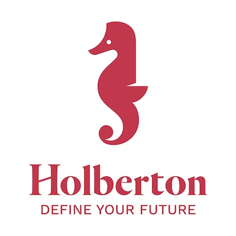

  
### Task 0. Basic application


**Create a basic app named dashboard using the build tool vite in your `task_0` directory.**

You will need a favicon, the Holberton logo, and a close button image. Download these files and place the logo and button images in the src/assets folder, and put the favicon in the public folder.

**holberton-logo.jpg**  




**favicon.ico**  


**close-button.png**  


**Remove unused files:**
- `index.css` 
- `public/vite.svg` and `src/assets/react.svg`

**Update `index.html`:**
  - Change title to "Holberton - School dashboard"
  - Change icon to Holberton's logo

Set up the following files in the project root folder:

- `setupTests.js`:
```
import '@testing-library/jest-dom';
```
- `.babelrc`:
``` 
{
    "presets": [
        "@babel/preset-env",
        ["@babel/preset-react", { "runtime": "automatic" }]
    ]
}
```

- `fileTransformer.js`:

```
import path from 'path';

export default {
    process(sourceText, sourcePath, options) {
        return {
            code: `module.exports = ${JSON.stringify(path.basename(sourcePath))};`,
        };
    },
};

```

- Configure Jest in `package.json`:

```

"jest": {
    "testEnvironment": "jsdom",
    "moduleNameMapper": {
  "\\.(jpg|jpeg|png|gif|eot|otf|webp|svg|ttf|woff|woff2|mp4|webm|wav|mp3|m4a|aac|oga)$": "<rootDir>/fileTransformer.js",
  "^.+\\.(css|less|scss)$": "identity-obj-proxy"
},
"setupFilesAfterEnv": [
  "./setupTests.js"
]
}
```

- Make sure to install the following packages:
  - `@babel/preset-env`
  - `@babel/preset-react`
  - `identity-obj-proxy`
  - `@testing-library/jest-dom`
  - `@testing-library/react`
  - `jest-environment-jsdom`
  - `@testing-library/user-event`

**In `task_0/dashboard/src/App.jsx`, create a function `App` that returns:**
- A `div` with a class `App-header` containing the Holberton logo with `alt` text: `holberton logo`, and a `h1` with the text `School dashboard` (color: #e1003c)
- A div with a class `App-body` containing a paragraph with the text `Login to access the full dashboard`
- A div with a class `App-footer` containing a paragraph with the text `Copyright {the current year e.g: 2025} - holberton School`

**Add the CSS styles to the `App.css` to match the design in the screenshot below:**


**Requirements:**

- Push your `package.json` and Make sure the jest package is included.
- Use the same names for the downloadable images (`holberton-logo.jpg`, `close-button.png`, `favicon.ico`).
- Ensure the lint check passes without errors (hint: add `Jest` as the test runner in the ESLint configuration file).
- Make sure the app's style matches the screenshot.
- No lint errors

**My app rendition:**


